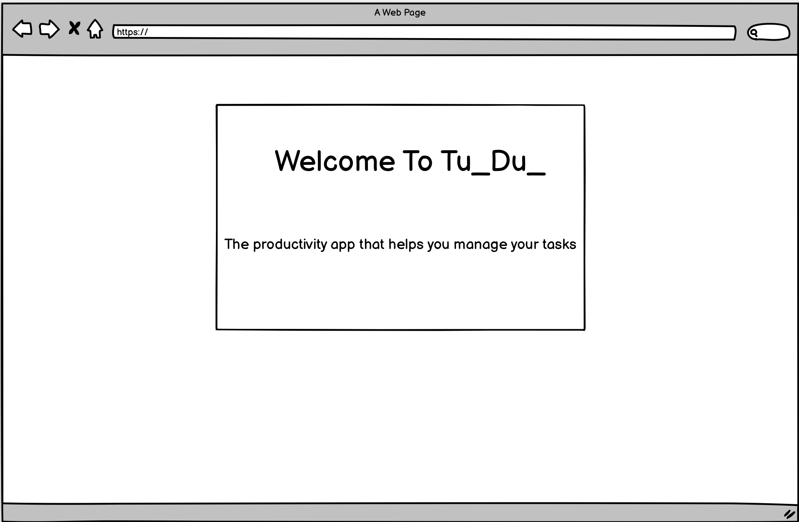
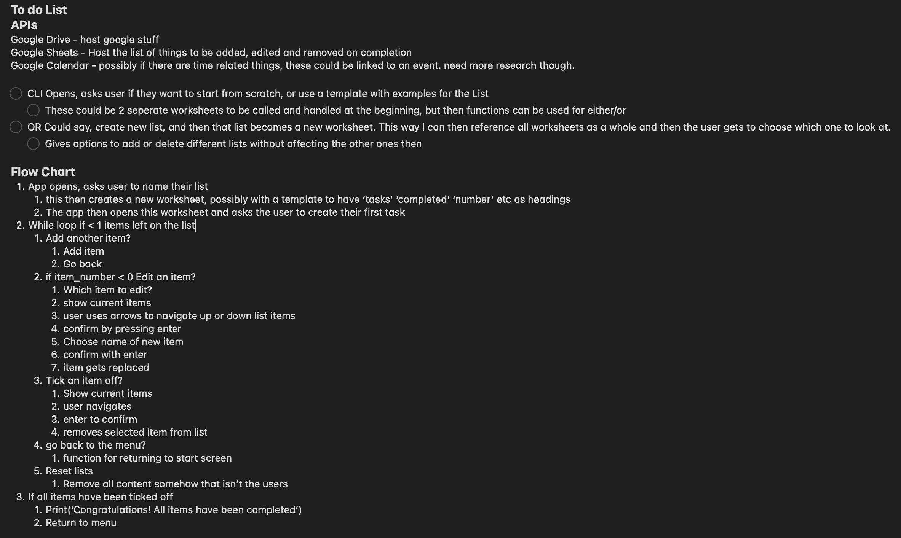
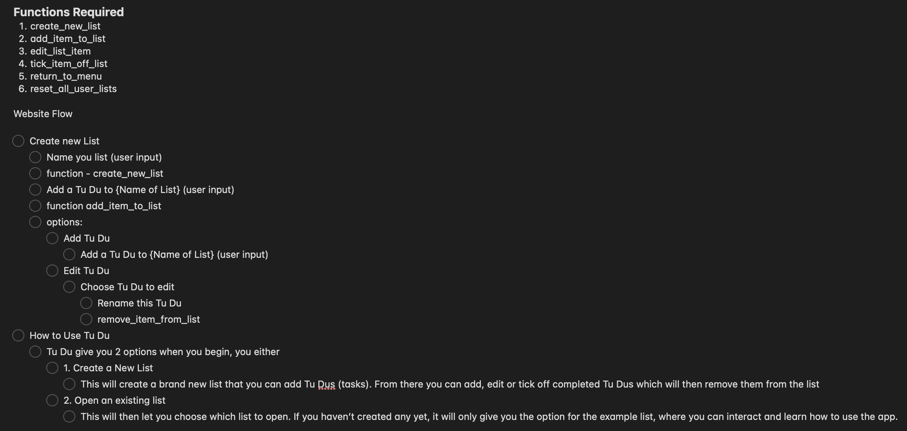
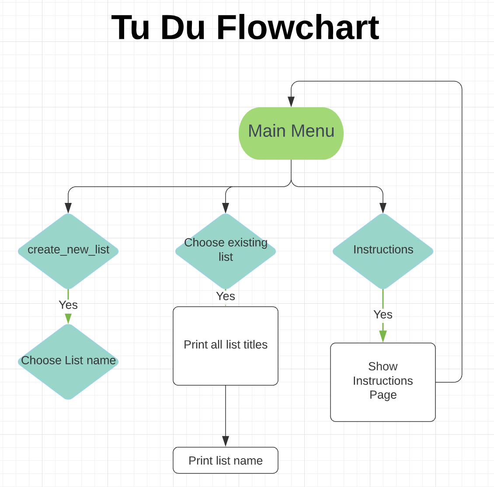
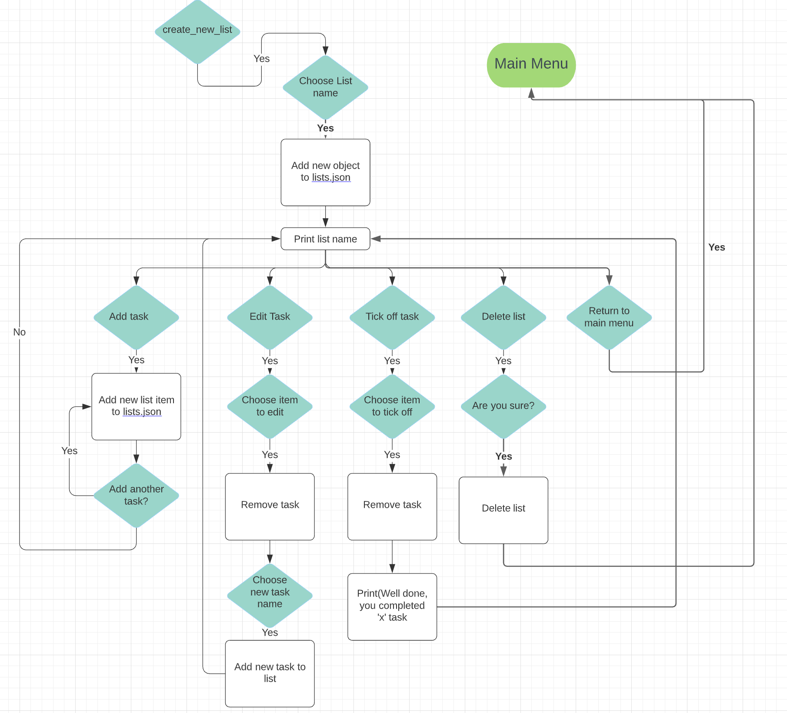
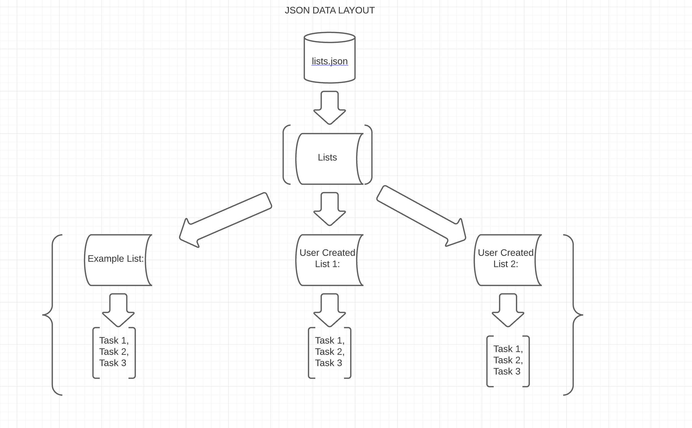
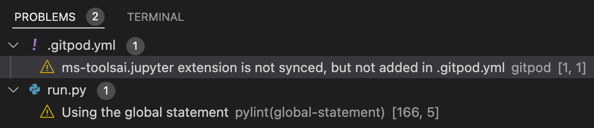
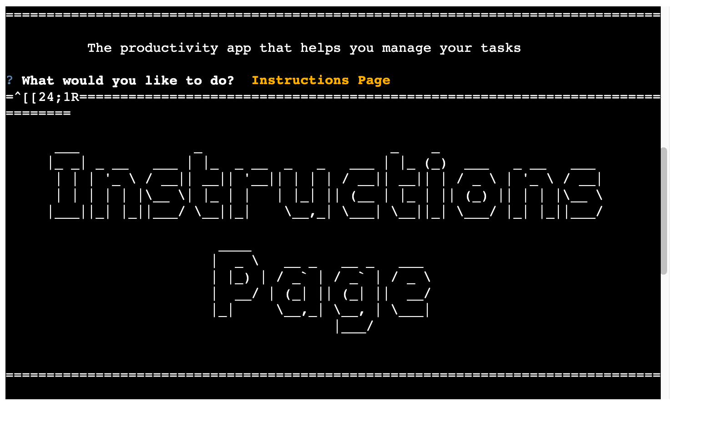
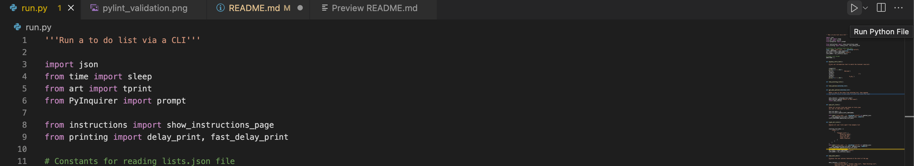

# TU_DU_

To open links in a new tab,
hold 'Command' + click on Mac, and 'ctrl' on Windows

## Live Site

[Tu_Du_](
  https://tu-du-list.herokuapp.com/)

## Repository

[tu_du_](
  https://github.com/Tom-Ainsworth/tu_du_)

---

## Table of Contents

- [TU_DU_](#TU_DU_)
  - [Live Site](#live-site)
  - [Repository](#repository)
  - [Table of Contents](#table-of-contents)
  - [Objective](#objective)
  - [Brief](#brief)
    - [Tu Du](#Tu-Du) 
  - [UX &#8722; User Experience Design](#ux--user-experience-design)
    - [User Requirements](#user-requirements)
      - [First Time User](#first-time-user)
      - [Returning User](#returning-user)
      - [Interested Party](#interested-party)
    - [Initial Concept](#initial-concept)
      - [Wireframes](#wireframes)
        - [Desktop](#desktop)
        - [Mobile](#mobile)
      - [Colour Scheme](#colour-scheme)
      - [Typography](#typography)
      - [Imagery](#imagery)
  - [Logic](#logic)
    - [Initial Plan](#initial-plan)
    - [Function Ideas](#function-ideas)
    - [Main Flow](#main-flow)
    - [Create List Flow](#create-list-flow)
    - [JSON Data Structure](#json-data-structure)
  - [Features](#features)
    - [Existing Features](#existing-features)
      - [UX](#ux)
      - [Keywords](#keywords)
    - [Features Left to Implement](#features-left-to-implement)
  - [Data Model](#data-model)
  - [Technologies Used](#technologies-used)
    - [Python Packages](#python-packages)
    - [Other Tech](#other-tech)
      - [VSCode Extensions](#vscode-extensions)
  - [Testing](#testing)
    - [Python Testing](#python-testing)
      - [Manual Python Testing](#manual-python-testing)
        - [Manual Testing Documentation](#manual-testing-documentation)
      - [PEP8 Testing](#pep8-testing)
      - [Other Python Testing](#other-python-testing)
    - [W3C Validator](#w3c-validator)
      - [HTML](#html)
      - [CSS](#css)
    - [JSHint](#jshint)
    - [Lighthouse](#lighthouse)
  - [Bugs](#bugs)
    - [Current](#current)
    - [Resolved](#resolved)
  - [Development](#development)
    - [GitHub](#github)
    - [VSCode](#vscode)
      - [Cloning](#cloning)
      - [Editing](#editing)
    - [Working With Python](#working-with-python)
      - [Venv](#venv)
      - [Packages](#packages)
      - [Debugging](#debugging)
    - [Google Sheets](#google-sheets)
      - [Creating Sheets](#creating-sheets)
      - [API Credentials](#api-credentials)
  - [Deployment](#deployment)
    - [Heroku](#heroku)
  - [Credits](#credits)
    - [Content](#content)
    - [Media](#media)
    - [Acknowledgements](#acknowledgements)

---

---

## Objective

Design and deploy an interactive To Do List that connects to a local JSON file to read and write user submitted tasks
The project should run in a CLI, deployed via Heroku, using Python.

***This project was created to expand my knowledge of the Python programming language, and to satisfy the requirements for my Portfolio Project 3 assessment at Code Institute***

---

## Brief

### Tu Du

The goal of this app is to provide the user with an easy to use, interactive to do list, to help them be more productive throughout the day.

The app should:

- Be programmatically error free
- Be written using Python
- Handle all user input errors gracefully and appropriately
- Give clear instructions regarding use and valid inputs
- Store user inputted data in a JSON file

---

## UX &#8722; User Experience Design

### User Requirements

Some example user stories which will affect the design

#### First Time User

> *"As a procrastinator, I would like to write down my daily goals to keep track of them and be more productive"*
>
> *"As a tech nerd I want to see if I can create a to do list app that functions properly and validates input"*
>
> *"As a developer new to Python, I would like to build my skills using a command line interface"*

#### Returning User

> *"As a returning user, I would like to create multitple lists to seperate my tasks into categories"*
>
> *"As a returning user, I would like to save my lists for the next time I come and use the app"*
>
> *"As a returning user, I would like to start again from scratch so I can create better lists now I know how to use the app"*

### Initial Concept

I intend to build a to do list inspired by the app Todoist on the Apple App Store. While my app will not be anywhere near as sofisticated, I plan on using either a JSON file to store the lists locally, and then use Python methods to read, write and remove data from the JSON file. To me this works in a similar fashion to connecting with a google sheets API, however having done that in the "Love Sandwiches" guided project, I thought using JSON would be an added challenge as I haven't worked with it as a separate file before.

#### Wireframes

Due to the nature of this project the wireframes are very basic. There is only
one page and the design does not change across any devices, only a change in
content.

##### Desktop

---

## Logic

I used flowcharts and bullet lists to map out how the app would work, so that I had a better idea of what needed to be done, and how I could store and call data. At first I wrote down a list of possible functions, and how they would interact with each other. This formed the base for the project, but as I progressed, I found that extra functions, or different approached needed to be taken. I used the Apples built in [Notes](https://en.wikipedia.org/wiki/Notes_(Apple)) app to do the first list mockup and later [Lucid](https://lucid.app/) to create the flowcharts. It has a variety of symbols and is really intuitive for beginners like me.

### Initial Plan

### Function Ideas

### Main Flow

### Create List Flow

### JSON Data Structure

---

## Features

### Existing Features

#### UX

> *"As a procrastinator, **I would like to write down my daily goals**"*
- The app allows users to create a list using the "Create New List" option, and then "Add a Tu_Du"
  to add daily goals or other tasks.
> 
> *"As a tech nerd, **I want to create a to do list app that validates input**"*
- When users enter either a list name, or a Tu_Du_ name, code checks for both empty inputs,
  as well as whitespaces such as "      " as an input. It then prints a message and loops back around
  for the user to try again
>
> *"As a developer new to Python, **I would like to build my skills using a command line interface**"*
- By completing this project, I have demonstrated my ability to create a functioning CLI app, which has taken
  a lot of work and research to build.

---

> *"As a returning user, **I would like to create multitple lists to seperate my tasks into categories**"*
- Users can create as many lists as they wish and name them whatever they choose. This could include "shopping",
  "Cleaning" "Work" as a few examples.
>
> *"As a returning user **I would like to save my lists**"*
- The "Save All Lists" menu option commits all lists and tasks to the lists.json file, so on the next load,
  users can continue where they left off.
>
> *"As a returning user **I would like to start again from scratch**"*
- The "Reset All Lists menu option will erase all user created lists, and load the default "Example List". This option
  doesn't require the user to save as it will commit the changes to lists.json as well.

---

### Features Left to Implement

I am really pleased with the final result of this app. To further develop it,
the following features would be very useful:

- Username and/or Password validation
  - Users can currently Save or Reset lists, but should another
  user use the app, they could overwrite the original work.
- Completed Tasks score
  - Users get a message once they have completed a Tu_Du_, but knowing how many they
    have completed in total would create a positive emotional response.
- Mouse Click support
  - Currently the app relies on up/down/enter keys to choose options. PyInquirer does support
    mouseclicks, however with the options being so close together, I opted not to add this yet
    to avoid unwanted user error and frustration.
- Nested lists
  - Should a user want to create a subfolder within a primary list, this could be quite useful.

---

## Data Model

A local JSON file was used to hold the lists. I went through a few iterations before landing on the current design. I haven't used separate JSON files before, and it was something that I wanted to implement on my previous project [Sorting Hat Quiz](https://github.com/Tom-Ainsworth/sorting-hat-quiz). I first thought of using a Google Sheet to hold the data, however as mentioned in the Initial Concept section, I was brand new to using JSON, and therefore opted to challenge myself. The current version makes use of a nested dictionary within the "Lists" list within the lists.json file. The keys are the list names, and their values are a nested list of tasks or Tu-Du's. This made it easy to access the data, and meant that the object never gets too deep.

## Technologies Used

### Python Packages

- [json](https://www.json.org/json-en.html)
  - JavaScript Object Notation, used for displaying and storing all lists and tasks. (See Data Model Section)
- [time](https://docs.python.org/3/library/time.html#time.sleep)
  - sleep: stalls the program for a defined time
- [art](https://pypi.org/project/art/)
  - tprint: Prints blown up strings in various fonts. I chose the default,
    but there are some really interesting ones! 
- [PyInquirer](https://pypi.org/project/PyInquirer/)
  - prompt: Define a list of questions and hand them to "Prompt" which gives
    back a list of "Choices" to be selected. Used for all of the menus.

---

### Other Tech

- *[Python](https://en.wikipedia.org/wiki/Python_(programming_language))*
  - Used to create the content of the app itself.
- *[HTML](https://en.wikipedia.org/wiki/HTML)*
  - Code Institute template files to create the terminal when deployed.
- *[CSS](https://en.wikipedia.org/wiki/CSS)*
  - Code Institute template files to create the terminal when deployed.
- *[JavaScript](https://en.wikipedia.org/wiki/JavaScript)*
  - Code Institute template files to create the terminal when deployed.
- *[Balsamiq](https://balsamiq.com/)*
  - Balsamiq was used to create wireframes for the project.
- *[PEP8 online](http://pep8online.com/)*
  - An online Python code validation service.
- *[Heroku](https://www.heroku.com/)*
  - Used to deploy and host the app
- *[Gitpod](https://www.gitpod.io/)*
  - IDE used for creation and version control via Github.
- *[Tiny PNG](https://tinypng.com/)*
  - Used to compress all images features in this readme.

---

## Testing

### Python Testing

#### Manual Python Testing

The specification within the project requires manual testing. I have performed
multiple tests on the deployed site and during the development stage to ensure
data is handled correctly and all functions are carrying out their intended
actions.

Where user inputs are required, strip() has been used to test for empty inputs,
or whitespace inputs.

All other functions of the app use the Prompt feature, so users can only select from
a list of set inputs.

There were only 2 warnings found, one is a known error. The other is because I used
the "global" keyword within a function. While not ideal practice having global variables
of any kind, the keyword was necessary in order to properly update the json file, and allow
the app to continue operating with the most recent data.

The warnings can be seen here:

#### PEP8 Testing

The Python files have all been run through
[PEP8 online](http://pep8online.com/). The results are displayed
[here](readme-content/validation.md). No warnings or errors were found.

#### Other Python Testing

Two Python linters were used during the creation of this project.

- [Flake8](https://flake8.pycqa.org/en/latest/)
- [Pylint](https://pypi.org/project/pylint/)

While I found for the majority of the time they both alerted me to
identical issues. They both had their individual uses to keep my code
looking tidy and running properly.

---

## Bugs

### Current

- Unwanted text appears if user presses enter before prompt appears.
  

  I'm not completely sure how to fix this, as adding something to catch the error
  would throw up more unwanted text. The bug itself does not negatively affect anything
  major. The first Prompt activates after the opening text finished, which in this instance
  opens the Instructions Page (which I would rather people use initially anyway.)

  If a user pressed enter before any of the other prompts show, it will also choose the first
  option on the list. If this happens when an input is required, it will not enter the blank input.

---

### Resolved

1. App wasn't deploying to Heroku properly
- [Commit: 3177ccf](https://github.com/Tom-Ainsworth/tu_du_/commit/3177ccfec5b04b8f425ab8e78ce2a6b7336a1fb0?diff=split)
  To fix this I had to add the installed packages to `requirements.txt`. I then made sure to do this each time I added
  a new library/package.

2. `QUESTIONS` formerly named `main_menu` only had local scope and so wasn't very repeatable
- [Commit: d9f96d0](https://github.com/Tom-Ainsworth/tu_du_/commit/d9f96d06cba3f91ddf1e96b1c2c438e96c013f4c)
  As mentioned, `main_menu` is now named `questions` to avoid confusion with the `show_main_menu()`.
  Originally this was placed within the function, however I realised it wasn't very repeatable and I was
  having to copy/paste the entire dict to change `choices` key. I opted to make this a global variable, allowing me
  to edit `choices` in various places, and keep the prompts unified throughout the app.

3. Deciding how to read/write to `lists.json`
- [Commit: 705d537](https://github.com/Tom-Ainsworth/tu_du_/commit/705d5375d60261170b19e11057e33c95e32c538d)
- [Commit: 6409c25](https://github.com/Tom-Ainsworth/tu_du_/commit/6409c25528c77c57e77a198f7d117d7eb05af51f)
- [Commit: 4965ebc](https://github.com/Tom-Ainsworth/tu_du_/commit/4965ebce072c8e4f3108e28845b016268ad75844)
- [Commit: 226da97](https://github.com/Tom-Ainsworth/tu_du_/commit/226da975b2db6c0ea8a8e57b5c4626ff3e05400d)
  The above commits all relate to the same issue. As I am new to using JSON files, I went through several ways
  of accessing the data in `lists.json`. At first, I was using `with open()` statements for reading, then writing
  data `Commit: 705d537`. This was a long winded way of doing it, as it wasn't necessary to update the list after each user change.
  I instead finally opted to open the file at the start of the program `Commit: 6409c25`. Then write to it only when necessary, in the
  `save_all_lists()` and `reset_all_lists()` functions. All other manipulation took place within the program, so users
  could still see the changes `Commit: 4965ebc`, `Commit: 226da97`.

4. Removing unused files
- [Commit: ee982ce](https://github.com/Tom-Ainsworth/tu_du_/commit/ee982ce2d3b188fbef3aa18697d4f98083e61325)
  At various times towards the end of the project I tried to hand off functions to seperate files in an attempt
  to clean up `run.py`. This resulted in several circular imports. I resolved these imports by only having the necessary
  code, but as you can see from the above commit, it left only 1-2 lines. I didn't think this was worth the change, and
  issues caused by the change, so I kept all task/list handling in run.py.

5. Menu would ask user to complete tasks even when the list was empty
- [Commit: acd94e3](https://github.com/Tom-Ainsworth/tu_du_/commit/acd94e392b8ba9f2201dbcd092ebb184a43f5aba)
  I added an `if not` statement to check for an empty list, and only show the relevant options if so.

6. Within the `Complete a Tu_Du_` option, "Return to Main Menu" was being appended as a string to the `selected_list`
- [Commit: f77c378](https://github.com/Tom-Ainsworth/tu_du_/commit/f77c378ccf444084436f9e42742dc920b7179477)
  The plan here was to append a menu option so users could go back without completing a task. Thanks to testing by
  [Maya Claveau](https://github.com/Maya-Claveau), they found this bug, which I then fixed by adding
  `get_menu_options(selected_list).

7. `save_all_lists()` & `reset_all_lists()` were not updating the global variables
- [Commit: a135c9b](https://github.com/Tom-Ainsworth/tu_du_/commit/a135c9bac7f4a4e2a7da29b8b76103140f007e2d)
  I had not realised that the global variables I created on lines 13-15 did not update themselves when their
  'parent' variable did. To fix this, I added statements to `reset_all_lists()` once I had written to `lists.json`
  so `show_exisiting_lists()` would update the content displayed.

8. Users could submit blank list or Tu_Du_
- [Commit: 74f495f](https://github.com/Tom-Ainsworth/tu_du_/commit/74f495f936a2f7b6dbb51ed3107e9408dd8d2e40)
  [Commit: f59e6f8](https://github.com/Tom-Ainsworth/tu_du_/commit/f59e6f89886baf396bb4dce6c63e0362dcad3029)
  These commits add the same check to different inputs. I used the `split()` method along with a while loop
  to catch any empty inputs, or whitespace inputs from spaces. This will display a message for the user, then
  ask them to try another input.

---

## Development

The site was made using [GitHub](#GitHub)

### GitHub

[GitHub Website](https://github.com)

- Sign in to GitHub.
- I used a template created by Code Institute that can be accessed
  [here](https://github.com/Code-Institute-Org/python-essentials-template) and is available for public use
  via the **Use this template** button.

### Working With Python

This section assumes you have python installed on your machine and added to
PATH. *I am unfamiliar with macOS so these steps may be different.*

#### Packages

To install all packages within this repo you can run `pip freeze` and then copy/paste
the result

To install individual packages you need to review the appropriate
documentation for the install command. All packages I have found and used were
installed using something similar to `pip install time`. The documentation
files are linked above under the [python packages](#python-packages) heading.

To run a file from the terminal I pressed the small "play button" icon to run the file.
Alternatively, you can open the file you wish to run, and type `python3 file_name` in the terminal.

## Deployment

### Heroku

- Navigate to your [heroku dashboard](https://dashboard.heroku.com/apps)
- Click "New" and select "Create new app".  
- Input a meaningful name for your app and choose the region best suited to
  your location.  
- Select "Settings" from the tabs.  
  - Click "Reveal Config Vars".  
    ![Config vars button](
  - Input `PORT` and `8000` as one config var and click add.  
  - Click "Add buildpack".  
  - Add "python" and "nodejs" from the list or search if necessary, remember to
    click save.
  - **Python must be the first buildpack.** They can be dragged into the correct
    position if needed.
- Select "Deploy" from the tabs.  
  - Select "GitHub - Connect to GitHub" from deployment methods.  
  - Click "Connect to GitHub" in the created section.  
  - Search for the GitHub repository by name.  
  - Click to connect to the relevant repo.  
  - Either click `Enable Automatic Deploys` for automatic deploys or `Deploy
    Branch` to deploy manually. Manually deployed branches will need
    re-deploying each time the repo is updated. Automatic will build the app
    each time you use you add, commit and push new code.
  - Click `View` to view the deployed site.

The site is now live and operational

---

## Credits

### Content

- The terminal function and template for the deployable application was
  provided by [Code Institute](https://codeinstitute.net), with special mention
  to [Matt Rudge](https://github.com/lechien73)

### Acknowledgements

- Thank you to [Ed Barron](https://www.linkedin.com/in/edward-barron-1598a841/).
  He's an incredible engineer who helped with a lot of syntax based issues I was
  having, particularly with reading/writing to `lists.json` I feel very lucky to
  know him and be able to pick his brain. He's helped me no end with understanding
  the **why** and **how** of what I'm writing.

- Thank you to [Spencer Barriball](https://www.linkedin.com/in/spencerbarriball/)
  He's been an amazing mentor and has put my mind at ease with several course based
  issues. Before starting this project we brainstormed ideas for what would be achievable,
  and it really gave me the confidence I needed to just get started with this.

- As always hank you to [Dave Horrocks](https://github.com/DaveyJH) for providing
  an incredibly detailed readme template to use, and just in general for being super
  helpful anytime I've had an issue or question.

- A special thanks to [Maya Claveau](https://github.com/Maya-Claveau) for continuously
  breaking the app during testing, allowing me to squish several bugs I otherwise would
  not have known existed!

